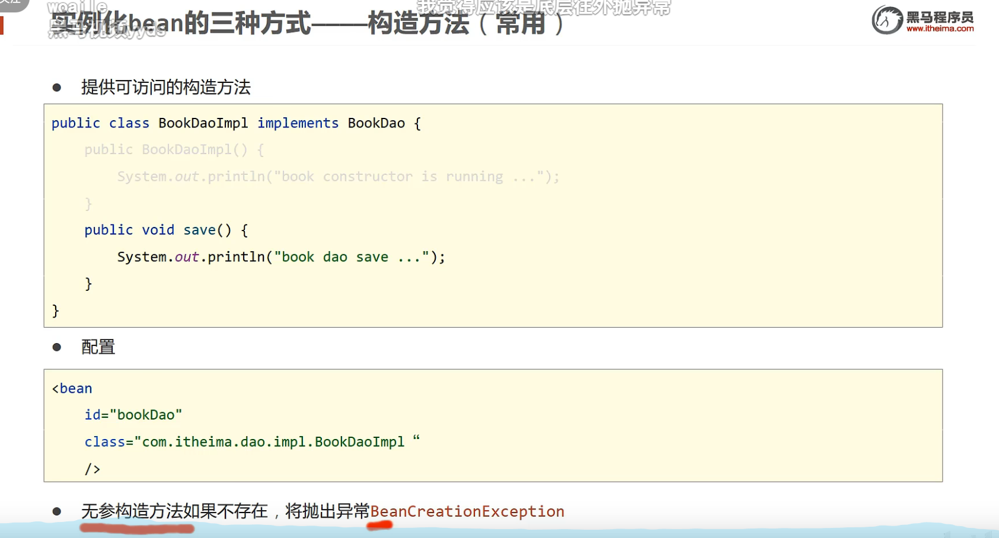
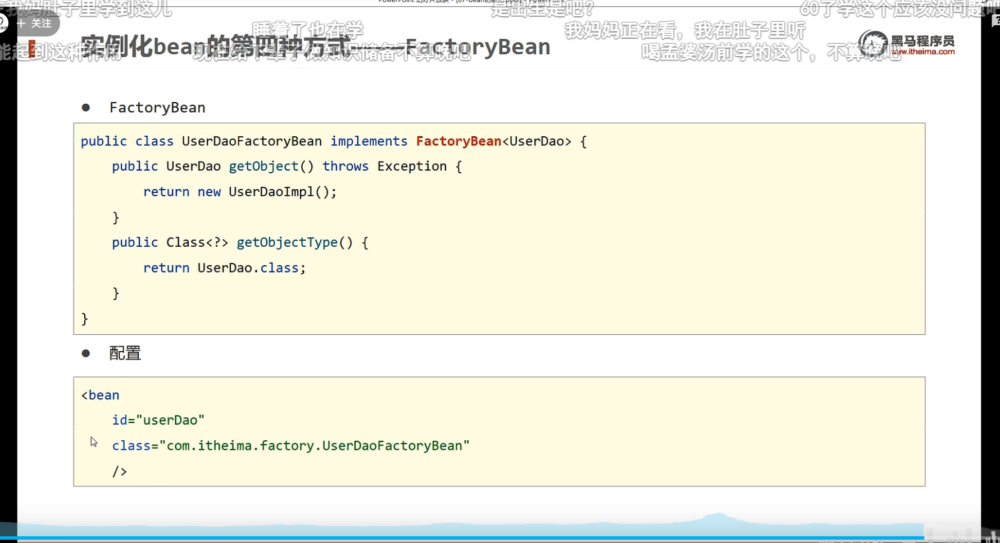
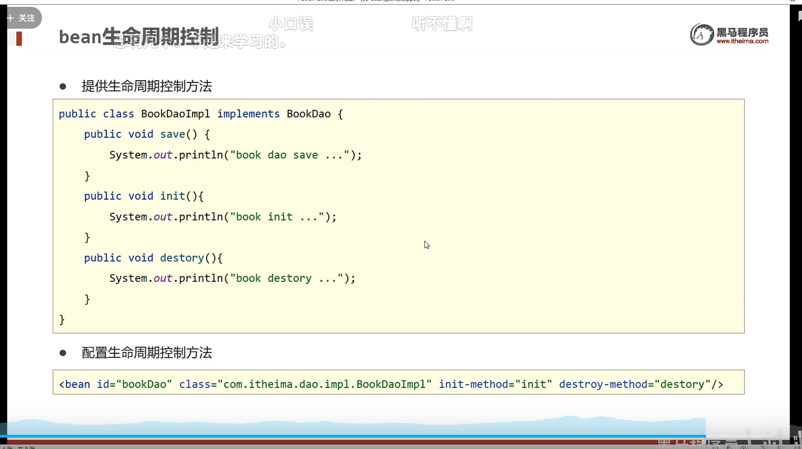
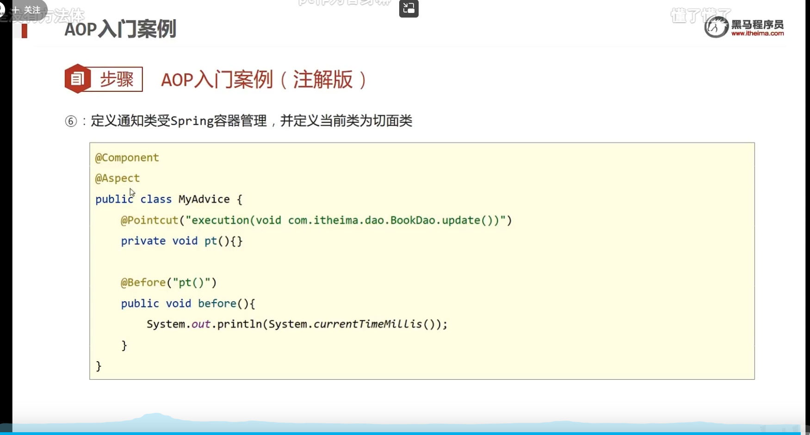

# 	Spring系统架构


## 2.核心容器Ioc


## 3. Ioc入门案例


**依赖于servlet还是要导入servlet坐标，还要导入tomcat插件。**


## 4. DI


**set方法是容器调用的**


## 5. bean的基础配置

==别名配置==


==作用范围==


**默认是单例，创建的是同一个对象。**


### 5.1 bean(对象)的三种实例化







### 5.2 bean的生命周期





## 6. setter注入


**注入属性没有顺序**。


## 7.构造器注入


## 8. 依赖自动装配


## 9.注入集合对象

==**也是使用的setter方法注入，需要在使用的类中创建set方法**==


## 10.数据源管理对象


## 11.加载properties文件


## 12.容器


## 13.前面内容的总结


# 注解开发

## 1.注解开发定义bean


**1.注意，还是通过spring的context空间进行扫描，需要先开辟context空间，开辟空间参考11.**


**2.以下三种都是衍生注解，作用是一样的**


## 2.纯注解开发模式

**==舍弃spring配置文件转为使用java类代替==**


**@ComponentScan用于扫描对应目录下的bean.**


## 3.注解开发管理bean的生命周期


## 4.注解开发做依赖注入


**需要在类中提供无参构造方法，但一般类中都默认带有无参构造方法**


### 1.引用类型注入


### 2.简单类型的注入


**value能够直接读取到properties中的数据，不需要配置任何东西**

**使用${}能够获取到properties中的数据，但是在获取username属性时，会自动获取到系统的名字。**


### 3.properties文件注入


**在Springconfig配置类中写注解**


### 4.管理第三方bean


### 5.为第三方bean实现资源注入


### 6.总结


## Spring整合MyBatis


## Spring整合Junit


# Aop

## 1.Aop简介


## 2.Aop入门案例





## 3.Aop的工作流程


**AOP工作核心是使用代理模式，通过匹配对应的切入点生成对应的原始类的代理，再走代理模式增强代码功能。**

**使用Aop后不知道为什么注入对象为实现类时会报错，无法找到实现类的bean**


## 4.Aop切入点表达式


**以搜索效率和准确度为重点，怎么准确怎么快就怎么写。**


## 5.Aop的通知类型


## 6.案例


## 7.Aop通知获取数据


**环绕方法能够获取参数，并且返回修改后的参数**

```java
//环绕通知获取参数并返回修改后的参数
public Object servicetongzhi(ProceedingJoinPoint pjp) throws Throwable {
    //获取参数
    Object[] args = pjp.getArgs();
    System.out.println(Arrays.toString(args));
    //给参数去空格
    for (int i = 0; i < args.length; i++) {
        //如果object对象中的参数类型为String类型
        if (args[i].getClass().equals(String.class)){
            //将数组中的类型转换为String类型并去空格
            args[i] = args[i].toString().trim();
        }
    }
    //将修改好的参数传递回去
    Object ret = pjp.proceed(args);
    //返回参数
    return ret;
}
```


## 8.总结


# Spring事务


**保障业务和数据层同时成功同时失败**


## 1.Spring事务管理的使用


**1.在JdbcConfig配置文件中添加bean**

**2.以后要是数据库中使用的不是Jdbc的事务那就换接口下面的DataSourceTransactionManager();**


## 2.Spring事务角色


## 3.事务的传播行为


```java
@Transactional(propagation = Propagation.REQUIRES_NEW);如果有事务我就新开一个事务，如果没有我也新开一个事务
```


# SpringMVC

## 1.简介


## 2.入门案例


**入门案例中使用到的注解：**


**入门案例中Tomcat加载SpringMVC配置的接口：**


## 3.入门案例工作流程


## 4.bean加载控制


**这里是方式二：**


**简化Spring的加载书写**


