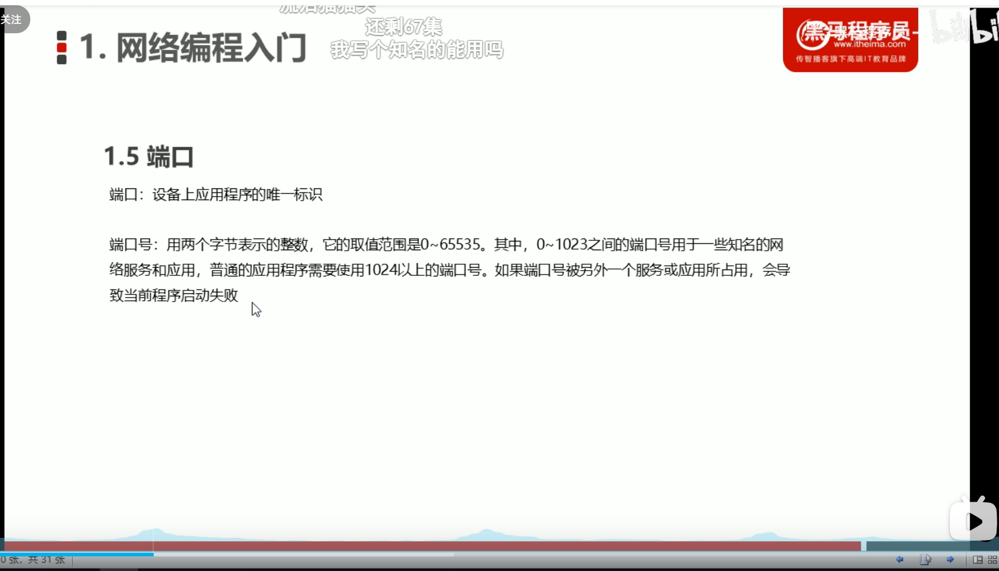
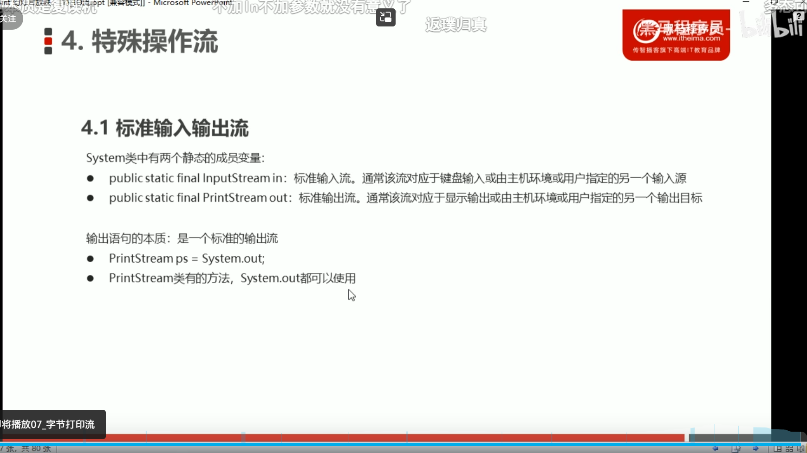

### 1.继承的使用


### 2.static修饰符的作用


**静态方法只能访问静态成员**；


### 3.多态的定义


### 4.多态的访问特点：


### 5.多态中的转型


### 6.抽象类


**注意：1.在以后的使用中会多次使用多态的思想，通过父类去引用子类对象，调用子类方法，编译看左边，执行看右边，子类重写父类中的抽象方法，当子类没有重写父类中的一些方法时，子类会继承父类方法，从而达到将父类中的所有方法实现。**

**2.子类中特有的方法能够通过父类向下转型达到调用子类特有的方法**。


### 7.接口特点

### 8.接口的成员特点


### 9.接口和类的关系


**注意：抽象类是对事物的抽象，而接口是对行为的抽象。**

### 10.接口案例


<u>接口与抽象类作为形参时要的都是其实现类或子类的对象，作为返回值时需要在该方法下创建其实现类或子类对象作为返回值</u>

### 11.内部类


**注意：<u>外部类访问内部类需要创建内部类的对象，内部类可以直接使用外部类对象</u>，而在其他类中私有的内部类无法直接创建对象，需要通过*<u>外部类中定义方法创建内部类对象，并进行方法的调用</u>*，在使用时只需要创建外部类的对象并进新方法的调用便可以使用内部类方法。**

### 12.匿名内部类


**内部类写法：new 类名或者接口名() {重写方法;};**

==本质是一个实现了该接口的子类匿名对象==


### 13. File类

 **---------------概述和构造方法--------------**


#### 1. File类创建功能


#### 2.File类判断和获取功能


#### 3.File类删除功能


### 14.字节流概述及分类


#### 1.IO流分类


<u>能读懂的文件用字符流，读不懂的文件用字节流，不知道用哪种就用字节流，字节流是万能的。</u>


#### 2.字节流写数据的三种方法

​	==字节输出流FileOutputStream==


OutputStream和InputStream两个字节流都是抽象类，使用其子类来实例化对象。

```java
//1.创建了文件2.创建了字节输出流对象3.让字节流对象指向文件
	FileOutputStream fos=new FileOutputStream("C:\\Users\\王皓\\Desktop\\新建文件夹 (2)\\fos.txt");
//FileOutputStream(String name, boolean append) 追加写入
	FileOutputStream fos1 = new FileOutputStream("C:\\Users\\王皓\\Desktop\\新建文件夹 (2)\\fon.txt", true);
```


#### 3.字节流写入加异常处理

==finally关键字不管在什么情况下都会执行。==

```java
FileOutputStream fos = null;
		try {
			fos = new FileOutputStream("C:\\Users\\王皓\\Desktop\\新建文件夹 (2)\\fos.txt");
			fos.write("abcd".getBytes());
		} catch (FileNotFoundException e) {
			// TODO Auto-generated catch block
			e.printStackTrace();
		} catch (IOException e) {
			// TODO Auto-generated catch block
			e.printStackTrace();
		} finally {
	//如果fos创建失败则fos会为null，会抛出空指针异常，所以要进行fos是否创建成功判断；
			try {
				if (fos != null) {
					fos.close();
				}

} catch (IOException e) {
			// TODO Auto-generated catch block
			e.printStackTrace();
		}
	}
}
```


#### 4.字节流读数据

==字节输入流 FileInputStream==

方法：


```java
			//是outputstream的子类
	public static void main(String[] args) throws IOException {
		// TODO Auto-generated method stub
		//read()从该输入流读取一个字节的数据,如果达到文件的末尾，返回-1 。
		 FileInputStream fos = new FileInputStream("C:\\Users\\王皓\\Desktop\\新建文件夹 (2)\\fon.txt");
		 int by;
		 //输出时不要人为的换行；
		while((by=fos.read()) != -1 ) {
			 System.out.print((char)by);
		 }
		//read(byte[] b)从该输入流读取最多 b.length个字节的数据为字节数组。
          // b - 读取数据的缓冲区。 
			//off - 目标数组 b的起始偏移量 
			//len - 读取的最大字节数。 
		byte [] bys =new byte[1024];//一般定义为1024及其整数倍数
		int len;
		while((len=fos.read(bys)) != -1) {
			System.out.print(new String(bys,0,len));
		}
		//read(byte[] b, int off, int len)从该输入流读取最多 len字节的数据为字节数组。
		byte [] byts = new byte[1024];
		int lent;
		while((lent=fos.read(byts,0,9)) != -1) {
			System.out.print(new String(byts));
		}
		
		 fos.close();
	}
}
```

#### 5.字节缓冲流


```java
 FileInputStream fos = new FileInputStream("C");
	fon.write("廖嘉豪\n");
	fon.flush();
	BufferedInputStream fos = new BufferedInputStream(fos);

	//一次读取一个数组;
	/*char[] car = new char[1024];
	while((by=fos.read(car)) !=-1) {
		System.out.println(new String(car,0,by));
	}*/
	//一次读一个字符
	int bt;
	while((bt=fos.read()) != -1) {
		System.out.print((char)bt);
	}
	fon.close();
	fos.close();
}
}
```


### 15.字符流


```java
String s1 ="中国";
//可以指定获取的数据的编码格式
  byte[] gbks = s1.getBytes("UTF-8");
  System.out.println(gbks);
```

#### 1.编码表


​												**采用哪种编码编写数据，就要用哪种编码解码，否则就会乱码。**

##### 1.1 字符流的编码方法


```java
	String s1 ="中国";
		byte[] bytes = s1.getBytes("GBK");
		System.out.println(bytes);
//采用何种方式编码，就要采用何种方式解码
	System.out.println(new String(bytes,"GBK"));
```


#### 2.字符流写数据

可以指定其编码格式，其子类FileWriter不行

是字符流与字节流之间的桥梁，所以在参数中还是需要导入字节流对象

==OutputStreamWriter==


```java
//构造方法OutputStreamWriter(OutputStream out) 创建一个使用默认字符编码的OutputStreamWriter。 
OutputStreamWriter fs = new OutputStreamWriter(new FileOutputStream("C"));
    fs.write("a");
```

#### 3.字符流读数据

可以指定其解码格式，其子类FileReader不行

是字符流与字节流之间的桥梁，所以在参数中还是需要导入字节流对象

==InputStreamReader==


```java
//构造方法：InputStreamReader(InputStream in) 创建一个使用默认字符集的InputStreamReader。 
InputStreamReader fos = new InputStreamReader(new FileInputStream("E:\\学习笔记\\web\\java.md"));
//一次读取一个字符数组
char[] car = new char[1024];
int len;
while ((len = fos.read(car)) != -1) {
    // 写入数据 len表示读取数据的个数
    System.out.println(new String(car,0,len));
}

//fs.close();
fos.close();
```


#### 4.简化书写，使用字符输出输入流对应的子类

==OutputStreamWriter------FileWriter==

==InputStreamReader-------FileReader==


#### 5.字符缓冲流


==字符缓冲流复制文件的格式==

```java
  //根据数据源创建字符缓冲输入流对象
    BufferedReader br = new BufferedReader(new FileReader("E:\\学习笔记\\web\\java.md"));

    //根据目的地创建字符缓冲流输出流对象
    BufferedWriter bw = new BufferedWriter(new FileWriter("E:\\学习笔记\\web\\java.md"));

    //读写数据，复制文件
    //使用字符缓冲流特有功能实现

    String ss;
    while ((ss = br.readLine()) != null){
        bw.write(ss);
        //换行
        bw.newLine();
        bw.flush();
    }
    //释放资源
    br.close();
    bw.close();
}
```


### 15.1 IO流小结

==字节流==


==字符流==


#### 7.集合到文件（数据排序）


```java
TreeSet<Student> st = new TreeSet<>(new Comparator<Student>() {
    @Override
    public int compare(Student o1, Student o2) {
        int num = o2.zong() - o1.zong();
        int num2 = num == 0 ? o2.getYu() - o1.getYu() : num;
        int num3 = num2 == 0 ? o2.getShu() - o1.getShu() : num2;
        int num4 = num3 == 0 ? o1.getName().compareTo(o2.getName()) : num3;
        return num4;
    }
});

for (int i = 0; i < 5; i++) {
    Scanner sc = new Scanner(System.in);
    System.out.println("输入学生姓名");
    String xm = sc.next();
    System.out.println("输入学生数学成绩");
    Integer shu = sc.nextInt();
    System.out.println("输入学生语文成绩");
    Integer yu = sc.nextInt();
    System.out.println("输入学生英语成绩");
    Integer ying = sc.nextInt();

    Student student = new Student();
    student.setName(xm);
    student.setShu(shu);
    student.setYu(yu);
    student.setYing(ying);

    st.add(student);
}
BufferedWriter bw = new BufferedWriter(new FileWriter("E:\\学习笔记\\javascirpt.txt"));
for (Student i : st) {
    StringBuffer sb = new StringBuffer();

    System.out.println(sb.append(i.getName()).append(",").append(i.getShu()).append(",").append(i.getYu()).append(",").append(i.getShu()));
    bw.write(sb.toString());
    bw.newLine();
    bw.flush();

}
bw.close();
```


#### 8.字符流复制文件异常处理


### 16. InetAddress（IP）

==此类表示Internet协议（IP）地址==


### 17.端口和协议

​																												==端口==




​																											==协议==

**UDP**


​                         																				==三次握手==

**TCP**


#### 1.UDP协议

==发送==


==接收==


- - `DatagramPacket(byte[] buf, int offset,  int length, InetAddress address, int port)`  构造用于发送长度的分组数据报包 `length`具有偏移  `ioffset`指定主机上到指定的端口号。
  - - `DatagramSocket(int port)`  构造数据报套接字并将其绑定到本地主机上的指定端口。 

#### 2.TCP协议

==发送==


==接收==


### 18.标准输入输出流


1.输入输出流都属于字节流

2.通过键盘录入数据InputStream id = System.in;




### 19.打印流

==字节打印流==


==字符打印流==


### 类加载

#### 1.加载类的过程


#### 2.加载类的时机


#### 3.类加载器


### 反射

#### 1.概述


#### 2.获取Class类的对象方法


**要使用对象的反射首先要获取对应类的字节码Class对象**


#### 3.反射获取构造方法并使用


1.获取构造方法中的方法数据类型需要和构造方法中的数据类型相同使用String.class,int.class等参数类型

2.基本数据类型通过.class也可以获得对应的Class类型

3.获取到的私有方法不能直接用反射创建对象，需要暴力反射使用**constructor.setAccessible(true);**此方法中值为true时取消访问检查


```java
Class<Student> studentClass = Student.class;
Constructor<Student> constructor = studentClass.getDeclaredConstructor(String.class, Integer.class, Integer.class, Integer.class);
//暴力反射
constructor.setAccessible(true);
Student student = constructor.newInstance("张三", 40, 49, 40);
System.out.println(student);
```


#### 4.反射获取成员变量并使用


```java
//获取类的Class对象
Class<Student> studentClass = Student.class;
//获取指定成员变量的对象，成员变量时Filed类
  Field field = studentClass.getDeclaredField("name");
 //使用反射创建无参学生类对象
        Constructor<Student> constructor = studentClass.getConstructor();
        Student student = constructor.newInstance();
	//暴力反射
		 field.setAccessible(true);
   //使用成员变量对象方法进行赋值，括号中的意思是给student的name成员赋值
        field.set(student,"张三");

        System.out.println(student);
```


#### 5.反射获取成员方法并使用


```java
Class<Student> studentClass = Student.class;
Method declaredMethod = studentClass.getDeclaredMethod("st");

Constructor<Student> constructor = studentClass.getConstructor();
Student student = constructor.newInstance();

declaredMethod.setAccessible(true);

declaredMethod.invoke(student);
```
