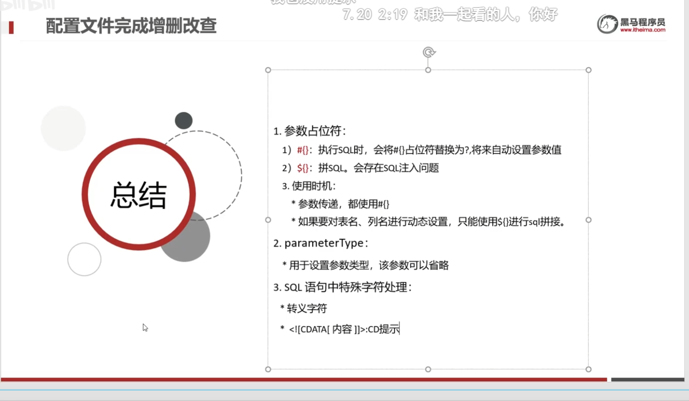

### 1.JDBC简介


#### ***<u>JDBC就是sun公司定义的操作数据库的接口，各个数据库厂商通过提供数据库驱动jar包实现该接口，通过接口去执行jar包中的实现类。</u>***


### 2.API

#### 			2.1 DriverManager

==1.通过getConnection方法获取数据库连接对象，返回一个Connection对象。2.注册驱动==


**注意：当使用的数据库为默认端口3306且是本机mysql数据库服务器时，可简写为`jdbc:mysql:///数据库名?参数键值对`**


#### 2.2 Connection

==1.获取执行SQL对象 2.管理事务==


***需要导入数据库jar包并且应用到该模块（导入到lib目录下，直接复制该文件粘贴即可）***

```java
Statement stmt = conn.createStatement();
```


#### 2.3 Statement

​	==执行SQL语句返回两种对象==


```java
int count1 = stmt.executeUpdate(sql1);
```


#### 2.4 ResultSet

==封装了DQl查询语句的结果==


```java
ResultSet rs = stmt.executeQuery(sql);
```

```java
while (rs.next()){
    int i = rs.getInt(1);
    String name = rs.getString(2);
    String job = rs.getString(3);

    System.out.println(i);
    System.out.println(name);
    System.out.println(job);

    System.out.println("---------------");
```

#### 

#### 2.5 PreparedStatemen

==预防SQL注入使用的方法==


==原理：==


### 3.数据库连接池


```java
//加载配置文件
Properties prop = new Properties();
InputStream ins = DruidDemo.class.getClassLoader().getResourceAsStream("com/itheima/druid.properties");
prop.load(ins);
//获取连接池对象
DataSource dataSource = DruidDataSourceFactory.createDataSource(prop);
//获取数据库连接对象
Connection connection = dataSource.getConnection();
System.out.println(connection);
```


#### 3.1 通过数据库连接池的增删改查

==增删改查==


### 4.Maven

==1.提供了一套标准化的项目结构== 

==2.提供了一套标准化的构建流程（编译，测试，打包，发布.....）==

==3.提供了一套依赖管理机制==


#### 4.1 Maven的主要命令


#### 

***1.同一生命周期内，执行后面的命令，前面的所有命令都会自动执行 ***

***2.要导入Maven工程只需要导入该工程的pom文件即可，最好是先将工程移动到Maven工作目录中，因为目录中含有中文会导致项目导入失败***


#### 4.2 Maven的配置


 ***需要坐标配置文件可以上网查，在pom文件中按alt+insert  选择 Dependency 搜索可以自动联想出最近使用过的jar包坐标配置***

```java
<dependencies>
    <!-- https://mvnrepository.com/artifact/mysql/mysql-connector-java -->
    <dependency>
        <groupId>mysql</groupId>
        <artifactId>mysql-connector-java</artifactId>
        <version>8.0.28</version>
    </dependency>
</dependencies>
```


#### 4.3 Maven配置中的依赖管理

==通过scope标签来设置jar包的作用范围==


### 5. MyBatis 简介与入门


***1.在pom文件中加载mybatis框架所需要的依赖信息***

```java
<dependency>
    <groupId>org.mybatis</groupId>
    <artifactId>mybatis</artifactId>
    <version>3.5.10</version>
</dependency>
```

***2.定义mybatis的配置文件mybatis.xml***

```java
<?xml version="1.0" encoding="UTF-8" ?>
<!DOCTYPE configuration
        PUBLIC "-//mybatis.org//DTD Config 3.0//EN"
        "http://mybatis.org/dtd/mybatis-3-config.dtd">
<configuration>
    <environments default="development">
        <environment id="development">
            <transactionManager type="JDBC"/>
            <dataSource type="POOLED">
<!--       数据库连接信息         -->
                <property name="driver" value="com.mysql.cj.jdbc.Driver"/>
                <property name="url" value="jdbc:mysql://localhost:3306/abc?useUnicode=true&amp;characterEncoding=utf8"/>
                <property name="username" value="root"/>
                <property name="password" value=""/>
            </dataSource>
        </environment>
    </environments>
    <mappers>
<!--     加载Sql映射文件   -->
        <mapper resource="BrandMapper.xml"/>
    </mappers>
</configuration>
```

***3.创建sql映射文件 BrandMapper.xml***

```java
<?xml version="1.0" encoding="UTF-8" ?>
<!DOCTYPE mapper
        PUBLIC "-//mybatis.org//DTD Mapper 3.0//EN"
        "http://mybatis.org/dtd/mybatis-3-mapper.dtd">
<!--namespace    名称空间-->
<mapper namespace="test">
    <select id="selectAll" resultType="com.itheima.pojo.Brand">
    //定义sql语句
       select * from tb_brand;
    </select>
</mapper>
```

***4.在java项目中从pom.xml文件中构建SqlSessionFactory（工厂）***

```java
String resource = "org/mybatis/example/mybatis-config.xml";
InputStream inputStream = Resources.getResourceAsStream(resource);
SqlSessionFactory sqlSessionFactory = new SqlSessionFactoryBuilder().build(inputStream);
```


#### 5.1 Mybatis中的Mapper代理开发


==1.==

==2.==

==3.==


==4.==


#### 5.2 Mybatis核心配置文件详解


#### 5.3 MyBatis的增删改查模板


##### 5.3.1 查询所有数据


```java
<?xml version="1.0" encoding="UTF-8" ?>
<!DOCTYPE mapper PUBLIC "-//mybatis.org//DTD Mapper 3.0//EN" "http://mybatis.org/dtd/mybatis-3-mapper.dtd" >
<mapper namespace="com.itheima.mapper.BrandMapper">

<!--    定义resultMap完成不一致的属性名和列名的映射-->
<!--  column:表的列名   property:实体类的属性名  -->
    <resultMap id="all" type="brand">
        <result column="brand_name" property="brandName"></result>
        <result column="company_name" property="companyName"></result>
    </resultMap>

<!--    定义sql片段 提高复用性-->
<!--    <sql id="brand_column">-->
<!--        select * id,brand_name as brandName ,company_name as companyName,ordered,description,status-->
<!--    </sql>-->

<!--  对数据库列名与实体类的属性名不同时需要使用resultMap完成映射否则无法封装  -->
    <select id="selectAll" resultMap="all">
        select * from tb_brand;
    </select>
</mapper>
```

##### 5.3.2 查看详情



##### 5.3.3 条件查询


```java
public void selectByAll() throws IOException {
        int status = 1;
        String companyName = "华为";
        String brandName = "华为";

        companyName = "%" + companyName + "%";
        brandName = "%" + brandName + "%";

       // Brand brand = new Brand();
       // brand.setStatus(status);
       // brand.setCompanyName(companyName);
       // brand.setBrandName(brandName);

        Map map = new HashMap<>();
        map.put("companyName", companyName);
        map.put("status", status);
        map.put("brandName", brandName);

        //执行sql语句
//        List<Brand> brands = mapper.selectByAll(status,companyName,brandName);
//        List<Brand> brands = mapper.selectByAll(brand);
        List<Brand> brands = mapper.selectByAll(map);
        System.out.println(brands);
    }
```

```java
//    public List<Brand> selectByAll(@Param("status") int status, @Param("brandName") String brandName, @Param("companyName") String companyName);

//    public List<Brand> selectByAll(Brand brand);

    public List<Brand> selectByAll(Map map);
```

##### 5.3.4 动态查询Sql


```java
<where>
    <if test="status !=null">
        and status = #{status}
    </if>
    <if test="brandName != null and brandName !=''">
        and brand_name like #{brandName}
    </if>
    <if test="companyName !=null and companyName !=''">
        and company_name like #{companyName};
    </if>
</where>
```


```java
select *
from tb_brand
<where>
    //<choose> 相当于Java中的swith
    //<when> 相当于Java中的case
    //<otherwise> 相当于Java中的default
    <choose>
        <when test="status !=null">
            status = #{status}
        </when>
        <when test="brandName ！= null and brandName !='' ">
            brand_name = #{brandName}
        </when>
        <when test="companyName ！= null and companyName !='' ">
            company_name = #{companyName}
        </when>
    </choose>
</where>
```


##### 5.3.5 添加&修改


==返回添加数据的主键==

```java
// keyProperty指向id的属性名称
//id对应的是brand实体类的数据，需要通过brand类中的get方法获取值
<insert id="Add" useGeneratedKeys="true" keyProperty="id">
```


##### 5.3.6 删除功能


```java
delete from tb_brand where id in
    //将所需要删除的数据id封装为一个数组
    //froeach 标签用于遍历数组
    //collection 表示Map数值的键（mybatis中默认把数组封装为key为array values为数组值的Map集合）
    //item 表示集合中每一个元素进行迭代时的别名。#{item}
    //separator：表示在每次进行迭代之间以什么符号作为分隔符
    //open：表示该语句以什么开始（既然是 in 条件语句，所以必然以(开始）。
    //close：表示该语句以什么结束（既然是 in 条件语句，所以必然以)开始）。
<foreach collection="array" item="id" separator="," open="(" close=")">
    #{id}
</foreach>
```

##### 5.3.7 mybatis参数传递 @Param注解

![](../assets/image-20221016203958651.png


##### 5.3.8 注解开发


