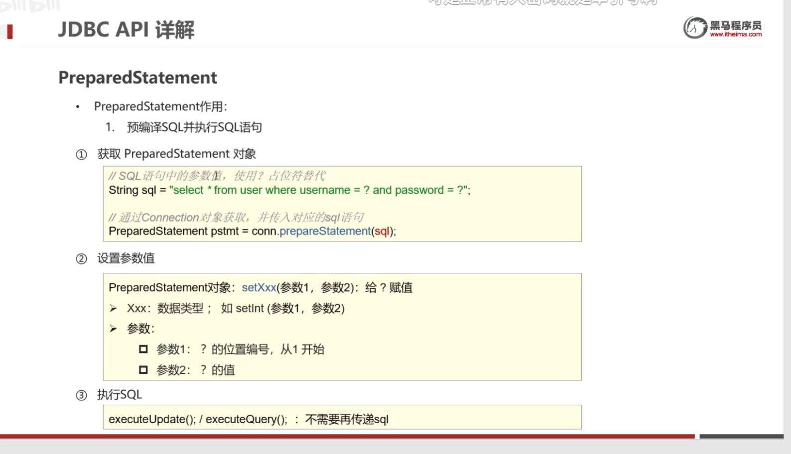
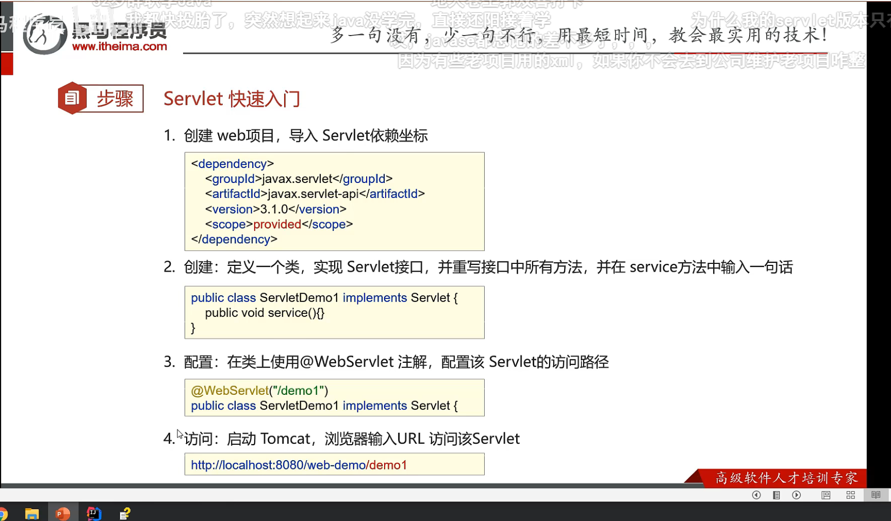
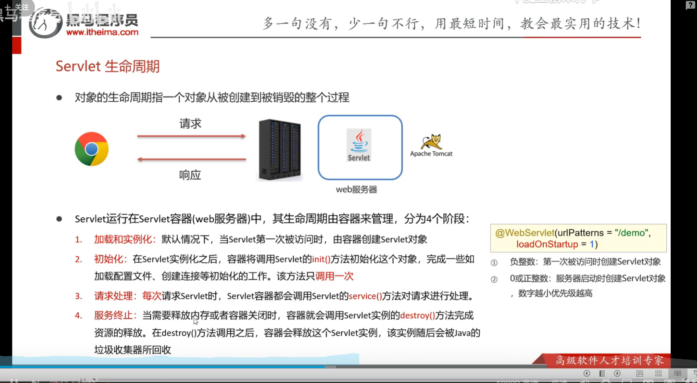
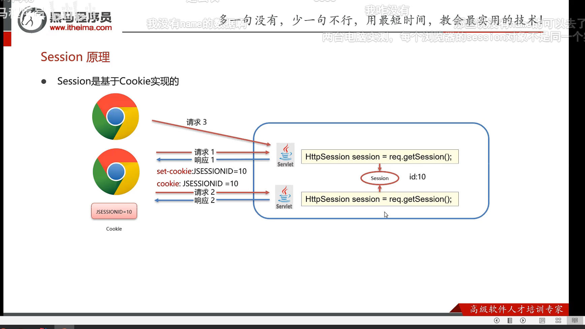
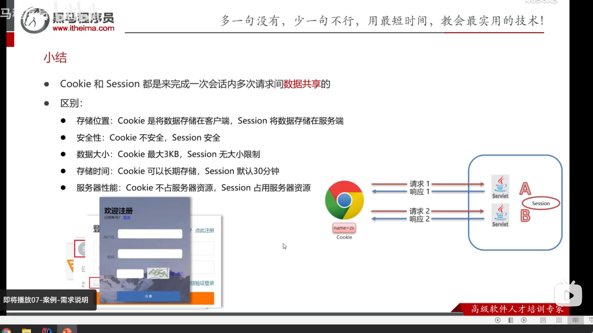
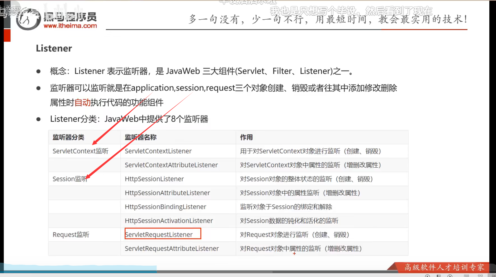
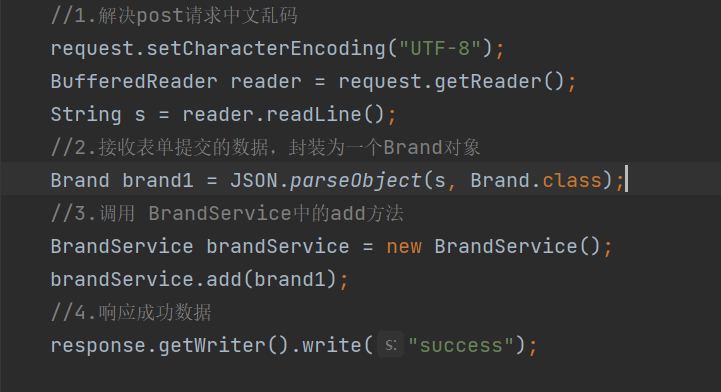
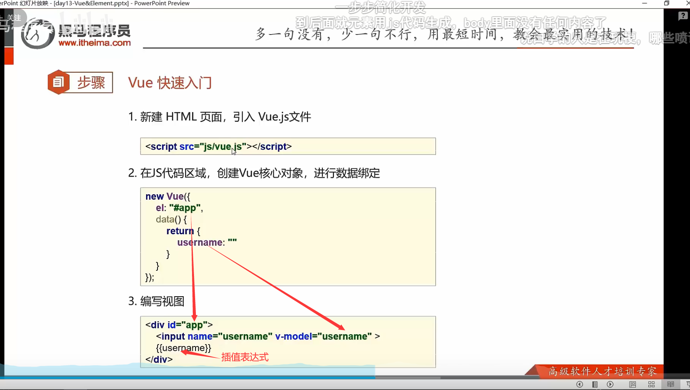

## 1.JDBC简介


**JDBC就是sun公司定义的操作数据库的接口，各个数据库厂商通过提供数据库驱动jar包实现该接口，通过接口去执行jar包中的实现类。**


## 2.API

### 			2.1 DriverManager

==1.通过getConnection方法获取数据库连接对象，返回一个Connection对象。2.注册驱动==


**注意：当使用的数据库为默认端口3306且是本机mysql数据库服务器时，可简写为`jdbc:mysql:///数据库名?参数键值对`**


### 2.2 Connection

==1.获取执行SQL对象 2.管理事务==


***需要导入数据库jar包并且应用到该模块（导入到lib目录下，直接复制该文件粘贴即可）***

```java
Statement stmt = conn.createStatement();
```


### 2.3 Statement

​	==执行SQL语句返回两种对象==


```java
int count1 = stmt.executeUpdate(sql1);
```


### 2.4 ResultSet

==封装了DQl查询语句的结果==


```java
ResultSet rs = stmt.executeQuery(sql);
```

```java
while (rs.next()){
    int i = rs.getInt(1);
    String name = rs.getString(2);
    String job = rs.getString(3);

    System.out.println(i);
    System.out.println(name);
    System.out.println(job);

    System.out.println("---------------");
```

#### 

### 2.5 PreparedStatemen

==预防SQL注入使用的方法==



==原理：==


## 3.数据库连接池

[[阿里巴巴(Druid)德鲁伊连接池——Java语言中最好的数据库连接池 - 知乎 (zhihu.com)](https://zhuanlan.zhihu.com/p/157607448)](https://zhuanlan.zhihu.com/p/157607448)


```java
//加载配置文件
Properties prop = new Properties();
InputStream ins = DruidDemo.class.getClassLoader().getResourceAsStream("com/itheima/druid.properties");
prop.load(ins);
//获取连接池对象
DataSource dataSource = DruidDataSourceFactory.createDataSource(prop);
//获取数据库连接对象
Connection connection = dataSource.getConnection();
System.out.println(connection);
```


### 3.1 通过数据库连接池的增删改查

==增删改查==


## 4.Maven

==1.提供了一套标准化的项目结构== 

==2.提供了一套标准化的构建流程（编译，测试，打包，发布.....）==

==3.提供了一套依赖管理机制==


### 4.1 Maven的主要命令


1.同一生命周期内，执行后面的命令，前面的所有命令都会自动执行 

2.要导入Maven工程只需要导入该工程的pom文件即可，最好是先将工程移动到Maven工作目录中，因为目录中含有中文会导致项目导入失败


### 4.2 Maven的配置


 ***需要坐标配置文件可以上网查，在pom文件中按alt+insert  选择 Dependency 搜索可以自动联想出最近使用过的jar包坐标配置***

```java
<dependencies>
    <!-- https://mvnrepository.com/artifact/mysql/mysql-connector-java -->
    <dependency>
        <groupId>mysql</groupId>
        <artifactId>mysql-connector-java</artifactId>
        <version>8.0.28</version>
    </dependency>
</dependencies>
```


### 4.3 Maven配置中的依赖管理

==通过scope标签来设置jar包的作用范围==


## 5. MyBatis 简介与入门


***1.在pom文件中加载mybatis框架所需要的依赖信息***

```java
<dependency>
    <groupId>org.mybatis</groupId>
    <artifactId>mybatis</artifactId>
    <version>3.5.10</version>
</dependency>
```

**2.定义mybatis的配置文件mybatis.xml，导入到resources文件夹中**

```java
<?xml version="1.0" encoding="UTF-8" ?>
<!DOCTYPE configuration
        PUBLIC "-//mybatis.org//DTD Config 3.0//EN"
        "http://mybatis.org/dtd/mybatis-3-config.dtd">
<configuration>
    <environments default="development">
        <environment id="development">
            <transactionManager type="JDBC"/>
            <dataSource type="POOLED">
<!--       数据库连接信息         -->
                <property name="driver" value="com.mysql.cj.jdbc.Driver"/>
                <property name="url" value="jdbc:mysql://localhost:3306/abc?useUnicode=true&amp;characterEncoding=utf8"/>
                <property name="username" value="root"/>
                <property name="password" value=""/>
            </dataSource>
        </environment>
    </environments>
    <mappers>
<!--     加载Sql映射文件   -->
         <package name="com.itheima.mapper"/>
    </mappers>
</configuration>
```

***3.创建sql映射文件 BrandMapper.xml***

```java
<?xml version="1.0" encoding="UTF-8" ?>
<!DOCTYPE mapper
        PUBLIC "-//mybatis.org//DTD Mapper 3.0//EN"
        "http://mybatis.org/dtd/mybatis-3-mapper.dtd">
<!--namespace    名称空间-->
<mapper namespace="接口的引用名com.itheimas.mapper.UsersMapper">
    <select id="selectAll" resultType="com.itheima.pojo.Brand">
    //定义sql语句
       select * from tb_brand;
    </select>
</mapper>
```

***4.在java项目中从pom.xml文件中构建SqlSessionFactory（工厂）***

```java
String resource = "org/mybatis/example/mybatis-config.xml";
InputStream inputStream = Resources.getResourceAsStream(resource);
SqlSessionFactory sqlSessionFactory = new SqlSessionFactoryBuilder().build(inputStream);
```

**5.定义实例类，获取sqlSession对象，再获取Mapper对象代理执行SQl语句**

```java
//获取sqlSession对象
////如果不设置参数或者参数为false就是手动提交事务，参数设置为true就是自动提交事务
SqlSession sqlSession = sqlSessionFactory.openSession();
//获取 mapper对象
UsersMapper mapper = sqlSession.getMapper(UsersMapper.class);
//执行sql语句
 Users users = mapper.selectall(username, password);
 //关闭资源
        sqlSession.close();
```


### 5.1Mybatis中的Mapper开发


==1.==

==2.==

==3.==


==4.==

**1.在resources目录创建目录时不能使用==.==他不会自动分层，你需要使用==/==来分层，例如java下的接口路径为com.itheima.mapper，那么resources目录中创建的路径应为com/itheima/mapper**

**2.格外注意第一步中需要在resources目录中新建与Mapper接口相同目录名的路径，用于存放接口的映射xml文件，因为java中是需要代码放一块，配置文件放另一块**


#### 5.1.1 MybatisX插件简化Mapper开发

要先安装好MybatisX插件，同时要创建好映射文件，以及接口文件（上面的第一步操作），然后在xml映射文件中写好配置，如下

```java
<?xml version="1.0" encoding="UTF-8" ?>
<!DOCTYPE mapper
        PUBLIC "-//mybatis.org//DTD Mapper 3.0//EN"
        "http://mybatis.org/dtd/mybatis-3-mapper.dtd">
<!--namespace   接口的引用路径-->
<mapper namespace="com.itheimas.mapper.UsersMapper">
```


### 5.2 Mybatis核心配置文件详解


1.添加了类型别名后相当于Mybtis扫描了这个包下的所有类，在写返回值时就不用写包名，也不用区分类的返回值的大小写。

```java
<select id="selectmian" resultType="user">//resultType对应返回值的类型
```


### 5.3 MyBatis的增删改查模板


#### 5.3.1 查询所有数据


```java
<?xml version="1.0" encoding="UTF-8" ?>
<!DOCTYPE mapper PUBLIC "-//mybatis.org//DTD Mapper 3.0//EN" "http://mybatis.org/dtd/mybatis-3-mapper.dtd" >
<mapper namespace="com.itheima.mapper.BrandMapper">

<!--    定义resultMap完成不一致的属性名和列名的映射-->
<!--  column:表的列名   property:实体类的属性名 type:对应的实体类类型 -->
    <resultMap id="all" type="brand">
        <result column="brand_name" property="brandName"></result>
        <result column="company_name" property="companyName"></result>
    </resultMap>

<!--    定义sql片段 提高复用性-->
<!--    <sql id="brand_column">-->
<!--        select * id,brand_name as brandName ,company_name as companyName,ordered,description,status-->
<!--    </sql>-->

<!--  对数据库列名与实体类的属性名不同时需要使用resultMap完成映射否则无法封装  -->
    <select id="selectAll" resultMap="all">
        select * from tb_brand;
    </select>
</mapper>
```

#### 5.3.2 查看详情


#### 5.3.3 条件查询


```java
public void selectByAll() throws IOException {
        int status = 1;
        String companyName = "华为";
        String brandName = "华为";

        companyName = "%" + companyName + "%";
        brandName = "%" + brandName + "%";

       // Brand brand = new Brand();
       // brand.setStatus(status);
       // brand.setCompanyName(companyName);
       // brand.setBrandName(brandName);

        Map map = new HashMap<>();
        map.put("companyName", companyName);
        map.put("status", status);
        map.put("brandName", brandName);

        //执行sql语句
//        List<Brand> brands = mapper.selectByAll(status,companyName,brandName);
//        List<Brand> brands = mapper.selectByAll(brand);
        List<Brand> brands = mapper.selectByAll(map);
        System.out.println(brands);
    }
```

```java
//    public List<Brand> selectByAll(@Param("status") int status, @Param("brandName") String brandName, @Param("companyName") String companyName);

//    public List<Brand> selectByAll(Brand brand);

    public List<Brand> selectByAll(Map map);
```

#### 5.3.4 动态查询Sql


```java
<where>
    <if test="status !=null">
        and status = #{status}
    </if>
    <if test="brandName != null and brandName !=''">
        and brand_name like #{brandName}
    </if>
    <if test="companyName !=null and companyName !=''">
        and company_name like #{companyName};
    </if>
</where>
```


```java
select *
from tb_brand
<where>
    //<choose> 相当于Java中的swith
    //<when> 相当于Java中的case
    //<otherwise> 相当于Java中的default
    <choose>
        <when test="status !=null">
            status = #{status}
        </when>
        <when test="brandName ！= null and brandName !='' ">
            brand_name = #{brandName}
        </when>
        <when test="companyName ！= null and companyName !='' ">
            company_name = #{companyName}
        </when>
    </choose>
</where>
```


#### 5.3.5 添加&修改


==返回添加数据的主键==

```java
// keyProperty指向id的属性名称
//id对应的是brand实体类的数据，需要通过brand类中的get方法获取值
<insert id="Add" useGeneratedKeys="true" keyProperty="id">
```


#### 5.3.6 删除功能


```java
delete from tb_brand where id in
    //将所需要删除的数据id封装为一个数组
    //froeach 标签用于遍历数组
    //collection 表示Map数值的键（mybatis中默认把数组封装为key为array values为数组值的Map集合）
    //item 表示集合中每一个元素进行迭代时的别名。#{item}
    //separator：表示在每次进行迭代之间以什么符号作为分隔符
    //open：表示该语句以什么开始（既然是 in 条件语句，所以必然以(开始）。
    //close：表示该语句以什么结束（既然是 in 条件语句，所以必然以)开始）。
<foreach collection="array" item="id" separator="," open="(" close=")">
    #{id}
</foreach>
```

#### 5.3.7 mybatis参数传递 @Param注解


#### 5.3.8 注解开发


## 6.Web核心


==核心技术==


### 1. HTTP


#### 1.1 HTTP数据请求格式


#### 1.2  HTTP数据响应格式


## 7.Web服务器 Tomcat简介


 Tomcat被称为Web容器，Servlet容器，Servlet类似于一个没有main方法的类，需要依赖于Tomcat才能够运行。


### 1. Tomcat的基本使用


在conf/server.xml中找到port更改Tomcat部署端口


### 2. IDEA中创建Maven Web项目


#### 2.1 使用骨架创建


#### 2.2 不使用骨架创建


补齐目录结构


### 3. IDEA使用Tomcat的方式

#### 1.本地集成Tomcat


#### 2. 使用插件集成


```xml
<build>
    <plugins>
        <plugin>
            <groupId>org.apache.tomcat.maven</groupId>
            <artifactId>tomcat7-maven-plugin</artifactId>
            <version>2.2</version>
            <configuration>
                <port>80</port>
                <path>/</path>
            </configuration>
        </plugin>
    </plugins>
</build>
```

## 8. Servlet简介


### 1.Servlet内容汇总


### 2. Servlet快速入门



1. **注意在导入Servlet依赖坐标时一定要添加scope标签，在标签中定义的依赖范围必须为provided，只允许测试和编译时使用jar包，不允许运行时使用，Tomcat中自带了jar包就不需要本地的jar打包进war包中。**

2. **在类上要使用@WebServlet注解，配置该Servlet的访问路径。**


### 3. Servlet执行流程


### 4. Servlet生命周期



```java
//初始化
@WebServlet(urlPatterns = "/maven-tomcat",loadOnStartup = 1)
```


### 5. Servlet方法&体系结构


#### 5.1 方法介绍


```java
//提升局部变量的作用域
private ServletConfig config;
@Override
public void init(ServletConfig servletConfig) throws ServletException {
    this.config=config;
    System.out.println("init");
}
@Override
public ServletConfig getServletConfig() {
    return config;
}
```


#### 5.2 HttpServlet的使用


**1.HttpServlet中封装了各个Servlet中各个请求方法，可以写一个类继承HttpServlet，根据html的不同的请求方式重写类中的请求方法**

```java
@WebServlet(urlPatterns = "/demo4")
public class ServletDemo1 extends HttpServlet {

    @Override
    protected void doGet(HttpServletRequest req, HttpServletResponse resp) throws ServletException, IOException {
        System.out.println("doGet.....");
    }

    @Override
    protected void doPost(HttpServletRequest req, HttpServletResponse resp) throws ServletException, IOException {
        System.out.println("doPost.....");
    }
}
```

**2.当xml文件中没有使用<path>标签指定默认为当前文件夹，html中指定的Servlet urlPattern路径需要在前面加上项目名称。**

```java
<form action="/maven-tomcat/demo4" method="post">
```


#### 5.3 Servlet中的urlPattern匹配规则


**urlpatterns可以设置多个值，是一个数组。**


注意：不要使用==/==或==/*==作为配置路径，否则会覆盖掉tomcat中的DefaultServlet。

### 6.Request（请求）

#### 	6.1 Request继承体系

==获取请求数据==


### 6.2 Request的方法

#### 	6.2.1 获取请求行数据


1.获取的路径是虚拟的，可以通过pom.xml文件中导入的Servlet模块中标签<pash>指定虚拟路径

2.获取的URL数据是StringBuffer类型可以通过toString方法转换为String类型

```java
//req.getMethod;获取请求方式:GET
String method = req.getMethod();
System.out.println(method);

//req.getContextPath();获取虚拟目录:/maven-tomcat
String contextPath = req.getContextPath();
System.out.println(contextPath);

//req.getRequestURL();获取(长的)URL(统一资源定位符):http://localhost:8080/maven-tomcat/demo5
StringBuffer requestURL = req.getRequestURL();
System.out.println(requestURL.toString());

// req.getRequestURI();获取(短的)URI(统一资源标识符):/maven-tomcat/demo5
String requestURI = req.getRequestURI();
System.out.println(requestURI);

//req.getQueryString();获取请求参数(GET方式):username=zhangsan&password=123
String queryString = req.getQueryString();
System.out.println(queryString);
```


#### 6.2.2 获取请求头和请求体数据


```java
//req.getHeader("user-agent");获取请求头:浏览器版本信息

String header = req.getHeader("user-agent");
System.out.println(header);
```

```java
protected void doPost(HttpServletRequest req, HttpServletResponse resp) throws ServletException, IOException {
    //调用doGet方法
    doGet(req,resp);
    
    // req.getReader();获取请求体:post
	//获取字符输入流
    BufferedReader reader = req.getReader();
    String s = reader.readLine();
    System.out.println(s);
}
```

1.doGet和doPost只有在获取请求参数的时候方法不一样，所以可以在doPost方法中调用this.doGet方法。

2.doGet直接获取字符串，doPost通过获取对应数据的流来读取。


#### 6.2.3 Requst通用方式获取请求参数


​	1.Requst将请求参数封装为Map集合，键值对，一个字符串对应一个字符串数组，当查询的字符串的键相同时，会将字符串中键对应的值拿出来拼接在一起。

​	2.可以通过键的名字获取参数数组或者单个参数。

​	3.获取到的数组需要遍历使用

```java
//获取到所有数据的Map集合
Map<String, String[]> stringMap = req.getParameterMap();
//遍历Map集合
for (String key : stringMap.keySet()) {
    //键找值，得到值的数组
    String[] strings = stringMap.get(key);
    System.out.print(key + ":");
    //遍历值的数组
    for (String i : strings) {
        System.out.print(i+" ");
    }
    System.out.println();
}
//获得单个键的多个值的数组
String[] hobbies = req.getParameterValues("hobby");
for (String hobby : hobbies) {
    System.out.println(hobby + "");

}
//获得单个键的单个值
String username = req.getParameter("username");
System.out.println(username);
```


### 6.3 Request使用Servlet模块创建


文件>设置>编辑器>文件和代码模块>其他>Web>Java代码模块>Servlet Annotated Class


### 6.4 中文乱码问题


1.根本原因是浏览器使用UTF-8将参数URL编码，而Tomcat使用ISO-8859-1解码，所以会导致乱码

2.通用方式是将Tomcat解码后的数据再次进行编码，使数据转换为最底层的二进制，再进行解码得到数据。

```java
//past请求中文乱码解决
//  request.setCharacterEncoding("UTF-8");
//get请求解决中文乱码问题
String username = request.getParameter("username");
//默认的解码方式
System.out.println(username);
//使用Tomcat的默认解码方式解码，编解码为十进制(java默认十进制)
byte[] bytes = username.getBytes(StandardCharsets.ISO_8859_1);

//使用UTF-8编码
String s = new String(bytes, "UTF-8");
System.out.println(s);
```


1.总结，通用方式先将Tomcat获得的参数解码为十进制，再将十进使用UTF-8制编码为字符串。

2.Post方式是通过流来获取参数，只需要先设置获取（要在获取参数前）流的解码格式为UTF-8即可。


### 6.5  请求转发


**setAttribute：将数据存储到request域中**

```java
//设置存储到request域中的数据
request.setAttribute("name","values");
//将数据转发到SeervletDemo6
request.getRequestDispatcher("/ServletDemo6").forward(request,response);
```


## 7.Rsponse（响应）

### 		7.1 Response中的方法


### 7.2 重定向


1.重定向可以到任意位置的资源，而转发只能在当前服务器内部的资源。

2.重定向是两次请求，不能在多个资源中使用request共享数据。

```java
//使用简化方式编写重定向
response.sendRedirect("https://www.baidu.com");
//给浏览器使用的地址需要写虚拟路径
  response.sendRedirect("/maven-tomcat/resp2");
```


### 7.3 资源路径问题


明确路径是给谁用的，浏览器用需要加虚拟路径，服务端用不需要加。


### 7.4 Response响应字符数据


通过`response.setContentType("text/html;charset=utf-8");`告诉浏览器解析的格式，以及指定tomcat的编码格式为utf-8.

```java
//字符输出流
response.setContentType("text/html;charset=utf-8");
//通过response获取字符输出流对象
PrintWriter writer = response.getWriter();
writer.write("傻逼螺纹蚝");
```


### 7.5 Response响应字节数据


导入依赖commons-io，使用IOUtils.copy方法复制文件到输出流中。

```java
//字节入出流
FileInputStream fileInputStream = new FileInputStream("\\E:\\shab.jpg");
//字节输出流
ServletOutputStream outputStream = response.getOutputStream();
//连接两个流，将输入流中的文件复制到输出流中输出
IOUtils.copy(fileInputStream, outputStream);
fileInputStream.close();
```


## 8. 用户登录注册案例

### 	1. 用户登录环境准备


### 2. 实现流程


**参照LoginServlrt**

### 3. 用户注册实现流程


**参照RegisterServlet**


### 4. 代码优化，抽取工具类


代码重复导致服务器负担严重，使用静态代码块抽取代码作为工具类使用。

必须要在mybatis中起类别名，否则会初始化失败。

```java
//工具类的设置

public class SqlSessionFactoryUlis {

    //提升变量的作用域，将方法中的变量变为成员变量
    static SqlSessionFactory sqlSessionFactory;

    //静态代码块，在类加载时一起初始化，且只初始化一次
    //静态代码块中无法直接抛出异常，使用try环绕
    static {
        String resource = "mybatis-config.xml";
        InputStream inputStream = null;
        try {
            inputStream = Resources.getResourceAsStream(resource);
        } catch (IOException e) {
            throw new RuntimeException(e);
        }
        //这里是赋值，上面已经定义了sqlSessionFactory的类型，所以不能再使用SqlSessionFactory进行修饰
        sqlSessionFactory = new SqlSessionFactoryBuilder().build(inputStream);

    }

    //返回一个sqlSessionFactory对象(连接池)，用户需要一人一个链接连接到连接池，而连接池只需要一个访问到数据库
    public static SqlSessionFactory getsqlSessionFactory() {
        return sqlSessionFactory;
    }

}
```


## 9.JSP概述与入门


**1.Jsp本质上就是一个servlet**

**2.既能在jsp编写html标签又能编写java代码**


### 1.快速使用


分三步使用：1.导坐标 2.建文件 3.写代码


### 2. JSP脚本(写代码)


### 3. JSP缺点


**不直接写java代码不代表不写java代码，通过新技术简化书写**

**1.EL表达式用于替换获取数据的java代码**

**2.JSTL标签用于替换循环遍历的java代码**


### 4. EL表达式


**请求转发到JSP中，因为Jsp也是一个Servlet所以可以通过存储数据到request域中，再将请求转发到Jsp中，通过Jsp中的El表达式获取数据内容。**


### 5.JSTL标签

#### 1.快速入门


**if标签表示判断**

```java
//判断要在{}内
<c:if test="${statuses ==1}">
    <h1>true</h1>
</c:if>
```


#### 2.froEach标签


varStatus="status"标签代表序号，他有两个属性，一个是count代表从1开始，一个是index代表从0开始。

```jsp
<c:forEach items="${brands}" var="brand" varStatus="status">
 <td>${status.count}</td>
 </c:forEach>
```


## MVC模式和三层架构


#### 1.三层架构(三大框架：SSM)


#### 2.MVC模式的实现


**1.三层架构其实就是对于MVC模式的一种具体实现架构思想。**

**2.各层分离，当需要更新技术时，只需要更换某一层级即可。**


## 9.案例

### 		1.环境配置


### 2.查询所有


### 3.添加


```java
brand.jsp---->addbrand.jsp---->AddServlet---->BrandService---->BrandMapper
//表单新增---->跳转到新增表单页面填写数据---->封装浏览器提交的数据---->调用数据添加方法---->数据添加方法    
```


### 4.修改-----回显数据


**点击修改后要先显示未修改前的数据，返回值是一个Brand对象**


### 5.修改-----修改数据


**不需要返回值，直接传入id获取后修改即可，最后将数据转发到查询所有的Servlet。**

### 6.删除


**与修改数据相似，将表单上的id通过超链接连接到DeleteServlet，DeleteServlet获取id后调用删除的Mapper方法最后转发到查询所有的Servlet。**


## 10. 会话跟踪技术


**解决一次会话中多次请求间的数据共享问题**


### 1.Cookie


#### 1.1Cookie的原理


**基于HTTP协议实现的。**


#### 1.2Cookie的存活和存储中文


**默认情况下Cookie存储在浏览器内存当中，当浏览器关闭内存释放，则Cookie销毁，可以通过setMAxAge方法设置Cookie存活的时间，将Cookie数据写入硬盘当中，持久化。**

```java
 //创建cookie对象，设置数据
 //设置中文数据
 String value = "张三";
//URLEncoder.encode编码
 value = URLEncoder.encode(value, "utf-8");
 Cookie cookie = new Cookie("username", value);
 //设置存活7天
// cookie.setMaxAge(60*60*24*7);
 //发送cookie对象到客户端保存
 response.addCookie(cookie);
```

```java
//获取客户端携带的所有cookie，使用request对象
Cookie[] cookies = request.getCookies();
//遍历数组，获得每一个cookie对象
for (Cookie cookie1 : cookies) {
    String name = cookie1.getName();
    if ("username".equals(name)) {
        String value = cookie1.getValue();
        //使用URLDecoder.decode，utf-8解码，显示中文
         value = URLDecoder.decode(value, "utf-8");
        System.out.println("username"+value);
        break;
    }
```


### 2.Session


```java
//获取Session域
HttpSession session = request.getSession();
//向域中储存数据
session.setAttribute("usernames","张三");
```

```java
//获取同一个Session域
HttpSession session = request.getSession();
//获取域中指定键的值
Object username = session.getAttribute("usernames");
System.out.println(username);
```


#### 2.1 Session原理



**基于Cookie实现的，当浏览器访问时服务端会生成一个Session通过Tomcat将一个带有==Session特有ID的cookie==存储到浏览器内存中，当浏览器再次发起请求时会将cookie放入到请求头中一起传输到服务器，服务器进行查找看是否有相同的==SeeionID==，==如果有就显示同一个Session域中的数据，没有则创建一个==。**


#### 2.2 Session钝化，活化，销毁


**1.服务器正常关闭后Tomcat会自动将Session数据写入硬盘文件中，服务器再次启动后文件会消失并自动加载到Session域中。**


**2.当浏览器关闭后再次打开Session对象就不是同一个了，Session会随着SessionID的消失而销毁。**

**3.Session销毁功能可以用于登出，默认30分钟就销毁。**


### 3.小结




### 4.案例—需求说明


#### 4.1 用户登录


#### 4.2 记住用户


#### 4.3 用户注册


#### 4.4 验证码 展示&校验

==展示验证码==


==校检验证码==


## 11. Filter—过滤器


**概念：是JavaWeb三大组件之一，能把对资源的请求拦截下来，过滤器一百年完成一些通用的操作。**


### 1.Filter快速入门


**定义类，实现Filter接口，重写所有方法，跟Servlet一样。**


### 2.执行流程


**1.放行后resquest数据中含有请求数据，而response数据没有数据，放行后response中也含有数据。**

**2.一般放行前对resquest数据进行处理，放行后对response数据进行处理。**


### 3.拦截路径配置


### 4.案例—登录验证


```java
@WebFilter("/*")
public class LoginFilter implements Filter {

    @Override
    public void doFilter(ServletRequest request, ServletResponse response, FilterChain chain) throws ServletException, IOException {
        //获取路径中的url
        HttpServletRequest req = (HttpServletRequest) request;
        //将StringBuff类型转换为String类型
        String url = req.getRequestURL().toString();
        //设置需要放行的文件
        String[] urls = {"/LoginServlet", "/imgs/", "/css/", "/longin.jsp", "/register.jsp", "/CheckCodeServlet", "/RegisterServlet", "/LoginAndEnroll"};

        //遍历数组获得每个需要放行的文件路径
        for (String s : urls) {
            //判断路径中是否包含了需要放行的文件路径
            if (url.contains(s)) {
                //包含了就放行
                chain.doFilter(req, response);
                //直接结束方法
                //获取完资源后还是会走到这并且在判断一遍，直接用return结束掉整个方法，返回时就不会再执行放行后方法了，只有在下一次请求时才会重新执行
                return;
            }
        }
        //获得在登录界面存储到session域中的用户信息
        HttpSession session = req.getSession();
        Object user = session.getAttribute("user");
        //判断是否登录了
        if (user != null) {
            //登陆了就放行
            chain.doFilter(req, response);
        } else {
            //没有登录，给出提示信息并跳转
            req.setAttribute("login_msg", "您尚未登录");
            req.getRequestDispatcher("/login.jsp").forward(req, response);
        }
    }

    public void init(FilterConfig config) throws ServletException {
    }
    public void destroy() {
    }
}
```


## 12.Listener监听器

==三大组件之一==



**基本上只使用第一个监听，用于监听web项目加载，当web项目加载成功时自动执行监听器，加载监听器下的资源和代码。**


## 13. AJAX

==作用1==


**用AJAX替换了JSP，通过AJAX来处理服务器与浏览器直接的数据交换，AJAX能够获取请求并获取服务器的数据。交换之后直接通过HTML进行展示。**


==作用2==


==作用3==


可以不用等待，客户端可以执行其他操作，后台会悄悄地处理数据然后在显示出来。


### 1.AJAX快速入门


**发送请求的路径写全路径。**


### 2.案例—验证用户是否存在


```html
<script>
    //1.给用户名输入框绑定一个失去焦点事件
    document.getElementById("username").onblur = function () {
        //2.1发送ajax请求
        //获取用户名的值
        var username = this.value;
        var xhttp;
        if (window.XMLHttpRequest) {
            xhttp = new XMLHttpRequest();
        } else {
            // code for IE6, IE5
            xhttp = new ActiveXObject("Microsoft.XMLHTTP");
        }
        //2.2向服务器发送请求
        //get请求直接在路径后面加上对应的数据
        xhttp.open("GET", "http://localhost:8080/AJAX_demo/selectByIdServlet?username="+username);
        xhttp.send();

        //2.3获取服务器响应数据
        function loadDoc() {
            var xhttp = new XMLHttpRequest();
            xhttp.onreadystatechange = function () {
                if (this.readyState == 4 && this.status == 200) {
                    //获取到selectByIdServlet中返回的数据
                    if (this.responseText == "true") {
                        //用户名存在，显示提示信息
                        document.getElementById("username_err").style.display="block";
                    }else {
                        //用户名不存在，隐藏提示信息
                        document.getElementById("username_err").style.display="none";
                    }
                }
            }
        };
    }

</script>
```


### 3.Axios基本使用


**对原生的AJAX进行封装，用于简化AJAX书写**

**resp.data一定不能加()，否则会无法显示数据**


### 4.JSON基础语法


**JSON作为数据的载体，用来表示数据**


**跟jsp的数据定义很像，但JSON是强语法，需要在key的值上加双引号。**


### 5.JSON数据和Java对象转换


### 6.案例—查询所有&添加


**brandname:"zhangsan"------>"brandname":"zhangsan"**

**axios会自动把jSP对象转换为JOSN对象**


### 7.JSON和JAVA数据的接收

==1.要想axios中获取到Java中的数据需要先将数据转换为JSON数据，如果数据中含有中文，需要指定tomcat编码格式，以及数据类型。==


==2.Java中要获取JSON数据需要用字节输入流来获取，通过获取字节流并读取字节流获取数据，再将数据转换为对应的类==



**因为是通过字节码文件传输，所以不存在乱码问题，可以不设置解码格式。**

## 14.Vue


### 1.快速入门




### 2.常用指令


### 3.生命周期


### 4.案例


## 15.Element


### 1.快速入门


==必须要先引入Vue.js==


### 2.Element布局


### 3.案例


